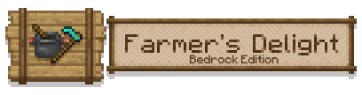

<h1 align="center">

农夫乐事 基岩版
</h1>

---

[[English](./README.md)|简体中文]

农夫乐事是一款JAVA版的热门模组，原作者为vectorwing，农夫乐事扩展了原版耕作与烹饪方面的内容，在以朴质的乡村生活为背景下，与Minecraft原版物品进行完美的融合，在扩展原生内容的同时也不会使得食谱体系变得淤积。

我们在遵守[原作MIT协议](https://github.com/vectorwing/FarmersDelight?tab=MIT-1-ov-file#readme)的情况下，将其移植到了基岩版。

本模组实现了对农夫乐事原作的大部分内容的移植还原，其还原度较高且在生存模式中基本完善了大部分流程以便可以正常使用。

## 下载

可以从[GitHub releases](https://github.com/ShangguanXi/FarmersDelightBedrock/releases)下载，也可以从[MC百科](https://www.mcmod.cn/class/14773.html)找到

## 游玩教程

在您初次使用农夫乐事时，若对农夫乐事的整体流程并不了解，您可以使用泥土和草杆合成一本农夫大典，自由翻阅农夫大典即可了解农夫乐事中独有的机制

你也可以先浏览 [这里](https://mcshelf.top/resources/A0152.html) 的模组介绍，感谢雪绒书屋制作的精美介绍。

## 可用语言

- 简体中文
- 繁体中文
- 英文[美国]
- 西班牙文[西班牙]
- 意大利文[意大利]
- 土耳其文[土耳其]

### 感谢以下人员对语言翻译工作所做的努力

- 语翌制作组 (zh_TW)
- Lintha (es_US)
- Sanjy (es_ES)
- Emeraldx392 (it_IT)

## 支持我们

如果您喜欢这个 Addon，并希望支持它的持续开发，欢迎赞助我们！您的支持将帮助我们改进功能、修复问题，并保持更新。无论金额多少，您的支持都是对我们最大的鼓励！

### 赞助方式

- [Patreon](https://www.patreon.com/Moaswies)
- [爱发电](https://afdian.com/a/moaswies)

### 感谢所有支持我们的人！❤️
